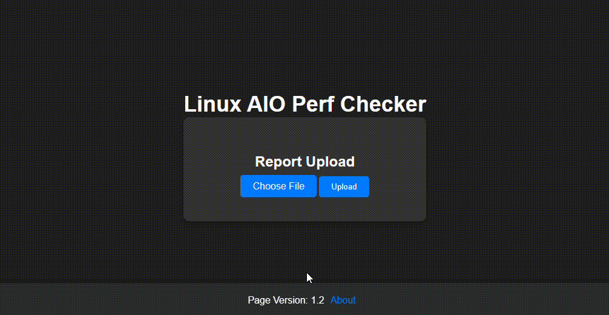

# Linux AIO Performance Checker

Linux AIO Performance Checker is a web application built with Flask that allows you to upload and process ZIP files containing performance data for analysis. It provides an intuitive interface to upload report files, extract their contents, execute performance analysis scripts, and view generated reports.

## Key Features

- All-in-one Linux Performance Collector Script
- Report generated directly over Web Application
- Fast, simple and user friendly.

## How to Collect Data (Capture)


1. You will need first to collect data from a Linux system using the collector: [Download Latest Release](https://github.com/samatild/LinuxAiOPerf/releases/latest) 
    
    Download it, and place it on the Linux system you want to collect data from.
    
    Example:
     ```bash
     wget https://github.com/samatild/LinuxAiOPerf/releases/download/v1.3/linux_aio_collector_release_v1.3.sh
     ```

2. Once uploaded to the Linux system, make it executable by running the following command:

   ```bash
    chmod +x linux_aio_perfcheck.sh
    ```

3. Execute the script as root:

   ```bash
    sudo ./linux_aio_perfcheck.sh 
    # Note: the script will ask you to enter the desired time interval for data collection The minimum time interval is 10 seconds. The maximum time interval is 900 seconds (15 minutes)
    ```

    > ⚠️ **Warning:** sysstat and iotop packages are required for the script to execute. If the package is not installed the script will prompt user to install them. If user disagrees the script will exit.

4. The script will collect performance data and generate a ZIP file containing the collected data. Upload the generated ZIP file to the [Linux AIO Perf Checker Web Application.](https://linuxaioperf.matildes.dev/)

## Generating Reports - How to



Use the following webpage to upload the ZIP file containing the performance data you want to analyze: [Linux AIO Perf Checker](https://linuxaioperf.matildes.dev/)

## Interpreting Reports

Work in progress... (will be updated soon with items below)

1. Report Overview
2. Understanding the metrics
3. Cross-referencing metrics with attached logs

## What data is collected?

The following data is collected:

| Resource Type | Collected Data |
|----------|----------|
| CPU  | mpstat, pidstat, uptime   |
| Memory   | vmstat, free   |
| Storage   | iostat, df -h, lsblk -f, parted -l, pvdisplay, vgdisplay, lvdisplay, pvscan, vgscan, lvscan, ls -l /dev/mapper, iotop   |
| Generic OS information   | date, top, ps -H, sar, os-release, last installed updates |


## Compatibility

The collector script is compatible with most modern Linux distributions as it uses standard OS commands to collect data.

It as been tested with the following Linux distributions:

- Ubuntu 18.04
- Ubuntu 20.04
- CentOS 7
- CentOS 8
- Red Hat Enterprise Linux 7
- Red Hat Enterprise Linux 8
- SUSE Linux Enterprise Server 15
- SUSE Linux Enterprise Server 12

## Data privacy

The data collected is not stored on the web server. The data is stored in a temporary directory on the web server and is deleted after 15 minutes.

Part of the data processing requires the execution of JavaScript code on the client-side. The JavaScript code is executed in the browser and does not send any data to the web server.

## Data Retention Policy

Every report will have its own unique ID. The UID is randomly generated and is not related to the data contained in the report. The UID is used to identify the report and to allow the user to view it. The UID is not stored in the database. The UID is used as the name of the directory where the report is stored.

Each time a user uploads a ZIP file containing performance data, the data is stored in a temporary directory on the web server. The data is deleted after 15 minutes.

## Credits

This project was developed by [Samuel Matildes](https://github.com/samatild)

The code makes use of the following open-source projects:
- Flask - [
The Pallets Projects](https://palletsprojects.com/p/flask/)
- plotly - [
plotly](https://plotly.com/)
- pandas - [
pandas](https://pandas.pydata.org/)
