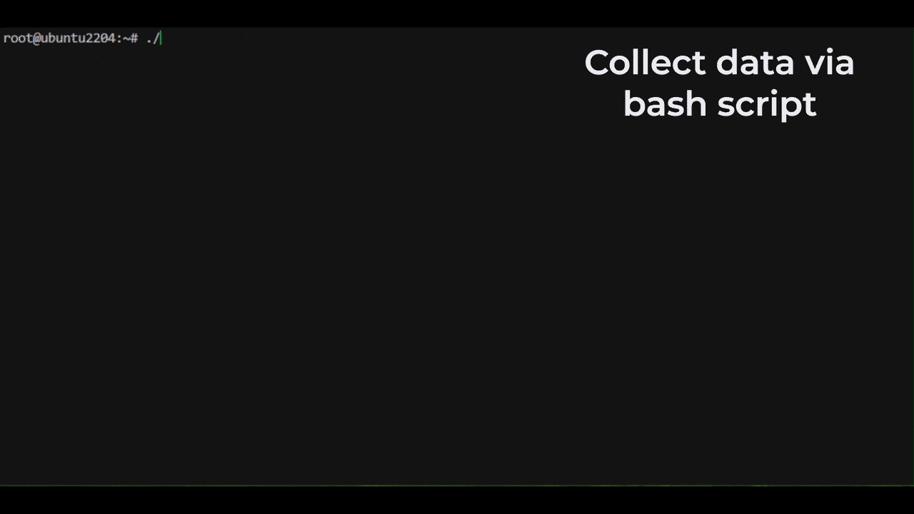

# Linux AIO Performance

[](https://github.com/samatild/LinuxAiOPerf/releases/latest)
[](LICENSE.md)

<p>
  
</p>

Linux AIO Performance helps investigate Linux performance problems. Run one collector script on the affected host, upload the generated archive, and explore an interactive report covering CPU, memory, disk, network, processes, and system configuration.

**[Open the hosted analyser](https://linuxaioperf.matildes.dev)** · **[Download a release](https://github.com/samatild/LinuxAiOPerf/releases/latest)**

## How it works

1. **Collect** — Run the shell script on a Linux system while an issue is happening, on a schedule, or through the watchdog.
2. **Upload** — The script creates a `.tar.gz` archive containing the collected data.
3. **Analyse** — Upload that archive to the [hosted analyser](https://linuxaioperf.matildes.dev) to inspect charts, process activity, disk metrics, and system details.

<p>
  
</p>

## Quick start

Run these commands on the Linux system you want to analyse:

```bash
curl -fsSLO https://raw.githubusercontent.com/samatild/LinuxAiOPerf/main/build/linux_aio_perfcheck.sh
chmod +x linux_aio_perfcheck.sh
sudo ./linux_aio_perfcheck.sh

# Or collect for 60 seconds without opening the interactive menu:
# sudo ./linux_aio_perfcheck.sh --quick -t 60
```

When collection finishes, upload the generated `.tar.gz` file at [linuxaioperf.matildes.dev](https://linuxaioperf.matildes.dev).

## What the report includes

| Area | Examples |
| --- | --- |
| CPU and memory | CPU distribution, load, `mpstat`, `pidstat`, `vmstat`, `free`, and memory information |
| Disk and storage | I/O metrics, filesystem usage, block devices, LVM, SCSI devices, and optional high-resolution disk counters |
| Network | Interface throughput and network activity |
| Processes | CPU, I/O, and memory consumers; `top`; and optional `iotop` data |
| System configuration | OS, kernel, hardware, CPU, security status, modules, and kernel parameters |

## Requirements

- Run as `root` or with `sudo`.
- Supported distributions: Debian 11/12, Ubuntu 18.04/20.04/22.04/24.04, RHEL 7/8/9, Oracle Linux 7/8, CentOS 7/8, and SLES 12/15.
- `sysstat` is required and the collector can install it when missing.
- `iotop` is optional. You can install it or choose `skip`; the report will omit only process I/O capture.
- `LC_TIME` must be `en_US.UTF-8`, `en_GB.UTF-8`, `C.UTF-8`, or `POSIX`. The script identifies incompatible locales and provides remediation instructions.

## Collection modes

### Interactive collection

```bash
sudo ./linux_aio_perfcheck.sh
```

Use the menu to start an immediate capture, configure the resource watchdog, schedule a cron collection, or enable 50 ms high-resolution disk counters.

### Command-line collection

```bash
# Capture for 60 seconds
sudo ./linux_aio_perfcheck.sh --quick -t 60

# Capture for two minutes with high-resolution disk counters
sudo ./linux_aio_perfcheck.sh --quick -t 120 -hres ON

# Use in automation after validating the host prerequisites yourself
sudo ./linux_aio_perfcheck.sh --quick -t 60 --skip-checks
```

### Watchdog and cron

Use these when a problem is intermittent or occurs on a known schedule:

```bash
# Check or stop the resource watchdog
./linux_aio_perfcheck.sh --watchdog-status
./linux_aio_perfcheck.sh --watchdog-stop

# List or remove scheduled collections
./linux_aio_perfcheck.sh --cron-list
./linux_aio_perfcheck.sh --cron-remove
```

The watchdog monitors CPU, memory, and disk I/O, then triggers a collection when configured thresholds are exceeded. Cron mode provides interactive schedule templates and custom expressions.

## Privacy and data handling

The collector archive can include hostnames, operating-system and hardware details, filesystem layouts, kernel settings, and process command information. Review your organisation's data-handling policy before uploading an archive to any hosted service.

The hosted analyser processes an uploaded archive to generate the report and does not use an application database. For environments that require the archive to remain inside your network, run the application locally.

## Run locally

The React frontend and analysis API can run together in Docker:

```bash
docker compose -f docker-compose.v3.yml up --build
```

Open `http://localhost:8000` and upload a collector archive.

## Command reference

```text
Commands:
  --quick                        Quick data collection mode
  --watchdog-status              Check watchdog status
  --watchdog-stop                Stop running watchdog
  --cron-list                    List scheduled cron jobs
  --cron-remove                  Remove scheduled cron jobs
  --version                      Show version information

Options:
  -t, --time SECONDS             Duration in seconds (10-900)
  -hres VALUE                    Enable or disable high-resolution disk counters (ON/OFF)
  --skip-checks                  Skip locale and package validation checks
```

## Documentation

For detailed collector and deployment documentation, see the [project wiki](https://github.com/samatild/LinuxAiOPerf/wiki).

## License

[MIT](LICENSE.md)
