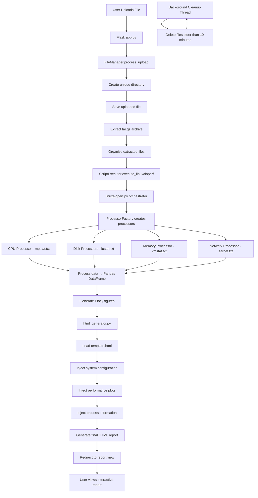

# Linux AIO Performance Checker - Architecture

## Domain Tree

```
LinuxAiOPerf/
├── app.py                          # Flask application entry point
├── core/                           # Core domain - base classes
│   └── base.py                     # Abstract base classes for processors
├── domains/                        # Domain layer
│   ├── factory.py                  # Processor factory
│   ├── perfanalysis/               # Performance analysis domain
│   │   ├── cpu/mpstat.py          # CPU performance processor
│   │   ├── disk/                  # Disk analysis processors
│   │   │   ├── diskiostat.py      # Per-device disk I/O
│   │   │   ├── diskmetrics.py     # Per-metric disk analysis
│   │   │   └── diskhighres.py     # High-resolution disk stats
│   │   ├── memory/vmstat.py       # Memory performance processor
│   │   └── network/sarnet.py      # Network performance processor
│   ├── procinfo/                   # Process information domain
│   │   ├── pidstat/               # Process statistics
│   │   │   ├── pidstatcpu.py      # CPU process stats
│   │   │   ├── pidstatio.py       # I/O process stats
│   │   │   └── pidstatmem.py      # Memory process stats
│   │   ├── top/topcmd.py          # Top command data
│   │   └── iotop/iotopcmd.py      # IOTop command data
│   ├── sysconfig/                  # System configuration domain
│   │   ├── system_info.py         # System information processor
│   │   └── lvm/lvmviz.py          # LVM visualization
│   ├── htmlgeneration/             # HTML generation domain
│   │   ├── html_generator.py      # Main report generator
│   │   ├── template_manager.py    # Template management
│   │   └── template.html          # HTML template
│   └── webapp/                     # Web application domain
│       ├── execution/              # Script execution
│       │   ├── linuxaioperf.py    # Main orchestrator
│       │   └── script_executor.py # Script execution handler
│       └── fileprocessing/         # File management
│           └── file_manager.py     # File upload/processing
├── static/                         # Static web assets
│   ├── style.css                  # Main stylesheet
│   ├── report_style.css           # Report stylesheet
│   ├── script.js                  # Main JavaScript
│   └── script_report.js           # Report JavaScript
└── templates/                      # Flask templates
    ├── upload.html                # Upload page
    ├── generic_error.html         # Error page
    └── bad_gzip_file.html         # File error page
```

## Application Flow



## Key Components

### Core Layer
- **BaseDataProcessor**: Abstract base class for all data processors
- **DataProcessorError**: Custom exception hierarchy
- **Common functionality**: Logging, validation, error handling

### Domain Processors
- **Performance Analysis**: CPU, Disk, Memory, Network data processing
- **Process Information**: Process monitoring and statistics (legacy wrappers)
- **System Configuration**: Hardware and system information
- **HTML Generation**: Report assembly and template processing
- **Web Application**: File handling and script execution

### Data Flow
1. **Upload**: User uploads performance data archive
2. **Processing**: File extraction and organization
3. **Analysis**: Domain processors analyze data and generate plots
4. **Assembly**: HTML generator combines all data into final report
5. **Delivery**: User receives interactive HTML report

### Background Services
- **Cleanup Thread**: Automatically removes old temporary files every 10 minutes
- **Process Isolation**: Each upload gets unique working directory
- **Error Handling**: Comprehensive error handling with user-friendly messages
